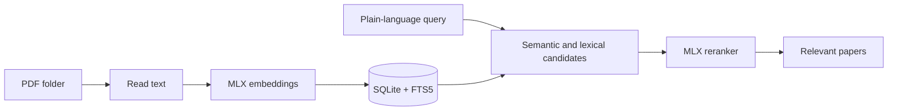

# Poogle

<p align="center">
  
</p>

I wanted the useful paper in a large PDF folder to be easier to find than the name I gave it months ago. Poogle searches the text and meaning of a local library, then opens the paper or reveals it in Finder. It stays on your Mac.



## How it behaves

Poogle fingerprints PDFs by their bytes, so moving or copying one does not make it embed the same document again. It extracts text with PyMuPDF, creates overlapping body chunks, and stores vectors with searchable text in SQLite.

At search time it collects semantic and exact-text candidates, then uses a cross-encoder reranker that reads each passage with the query. A query can return no results when nothing in the library clears the relevance checks; that is more useful than a confident-looking random list.

## Things to expect

The first run creates a Python environment and downloads the MLX models, so it takes longer and needs an internet connection once. Indexing a large library is deliberate work, and malformed PDFs may be skipped with a count in the app.

The interface is native SwiftUI, while the small Python worker does embeddings and reranking. It is built for Apple Silicon, not as a cross-platform reader.

## Install and run

Requires macOS 15 or newer on Apple Silicon, Xcode command-line tools, and Python 3.12.

```sh
git clone https://github.com/vladkalinichencko/Poogle.git
cd Poogle
./script/build_and_run.sh
```

The script prepares the worker, builds the app, installs it in `/Applications`, and launches it. Choose a PDF folder in Poogle, then synchronize it.

For tests:

```sh
swift test --disable-sandbox
```

## MCP server

The installed app is also a local MCP server. A normal launch starts SwiftUI; passing `--mcp` starts a JSON-RPC server over standard input and output:

```sh
/Applications/Poogle.app/Contents/MacOS/Poogle --mcp
```

`MCPServer` implements the small protocol boundary without another dependency. It exposes two tools:

- `sync_library` scans the folder selected in the app, embeds new PDFs, updates moved files, and removes missing files from the index.
- `search_papers` runs the same hybrid retrieval and MLX reranking used by the app, then returns titles, snippets, relevance scores, and local file paths.

The app and MCP server call the same `LibraryIndexer`, so the button and agent cannot drift into different synchronization behavior. The selected folder is stored in the app's user defaults, and both processes use the SQLite database at `~/Library/Application Support/Poogle/index-v3.sqlite`.

This is a local stdio server. The client must run on the same Mac and have access to `/Applications/Poogle.app`, the PDF folder, and Apple Silicon Metal.

### Codex

Codex desktop, CLI, and IDE clients on one host share MCP configuration. Add Poogle globally:

```sh
codex mcp add poogle -- /Applications/Poogle.app/Contents/MacOS/Poogle --mcp
```

Synchronization can take longer than Codex's default tool timeout. Set the Poogle entry in `~/.codex/config.toml` to:

```toml
[mcp_servers.poogle]
command = "/Applications/Poogle.app/Contents/MacOS/Poogle"
args = ["--mcp"]
tool_timeout_sec = 3600
```

See the [Codex MCP documentation](https://developers.openai.com/codex/mcp/).

### Cursor

Create `~/.cursor/mcp.json` to make Poogle available in every local Cursor project:

```json
{
  "mcpServers": {
    "poogle": {
      "command": "/Applications/Poogle.app/Contents/MacOS/Poogle",
      "args": ["--mcp"]
    }
  }
}
```

See the [Cursor MCP documentation](https://cursor.com/docs/context/mcp).

### Claude Code

Add Poogle at user scope so every local Claude Code project can use it:

```sh
claude mcp add --transport stdio --scope user poogle -- \
  /Applications/Poogle.app/Contents/MacOS/Poogle --mcp
```

Verify the connection with `claude mcp get poogle`. See the [Claude Code MCP documentation](https://code.claude.com/docs/en/mcp).

## Status

This is a source-available prototype while I am building it out. It has no license grant yet, and a future product version may use different terms.
