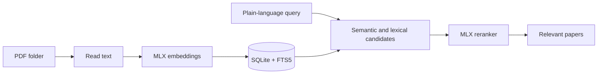

# Poogle

<p align="center">
  
</p>

I wanted the useful paper in a large PDF folder to be easier to find than the
name I gave it months ago. Poogle searches the text and meaning of a local
library, then opens the paper or reveals it in Finder. It stays on your Mac.



## How it behaves

Poogle fingerprints PDFs by their bytes, so moving or copying one does not make
it embed the same document again. It extracts text with PyMuPDF, creates
overlapping body chunks, and stores vectors with searchable text in SQLite.

At search time it collects semantic and exact-text candidates, then uses a
cross-encoder reranker that reads each passage with the query. A query can
return no results when nothing in the library clears the relevance checks; that
is more useful than a confident-looking random list.

## Things to expect

The first run creates a Python environment and downloads the MLX models, so it
takes longer and needs an internet connection once. Indexing a large library is
deliberate work, and malformed PDFs may be skipped with a count in the app.

The interface is native SwiftUI, while the small Python worker does embeddings
and reranking. It is built for Apple Silicon, not as a cross-platform reader.

## Install and run

Requires macOS 15 or newer on Apple Silicon, Xcode command-line tools, and
Python 3.12.

```sh
git clone https://github.com/vladkalinichencko/Poogle.git
cd Poogle
./script/build_and_run.sh
```

The script prepares the worker, builds the app, installs it in `/Applications`,
and launches it. Choose a PDF folder in Poogle, then synchronize it.

For tests:

```sh
swift test --disable-sandbox
```

## Status

This is a source-available prototype while I am building it out. It has no
license grant yet, and a future product version may use different terms.
